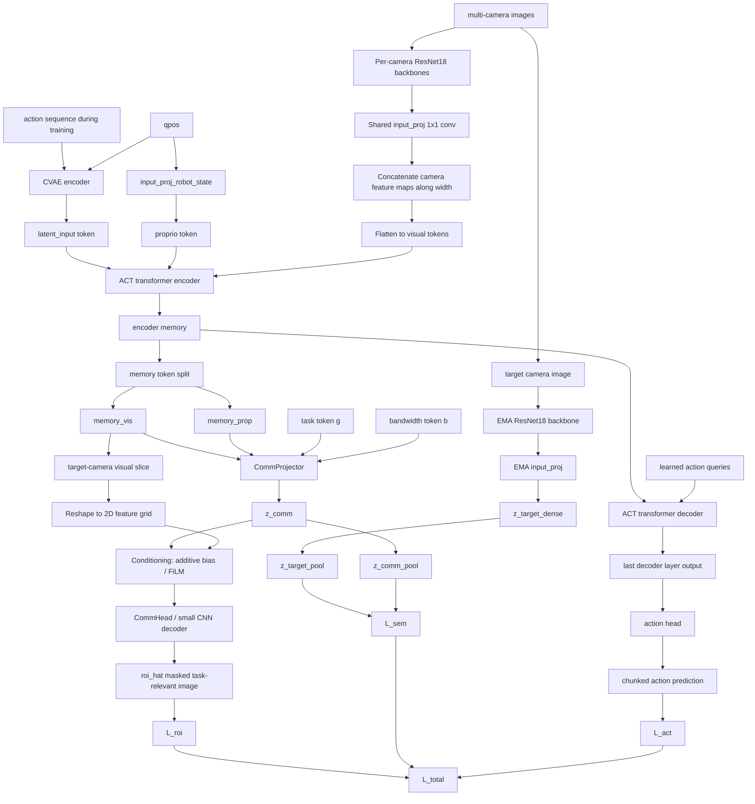

# Variant A: Video-Action Semantic Reconstruction

## Goal

Extend the existing ACT policy with a **communication head** that reuses ACT's shared visual representation while preserving action performance.

This variant is intentionally conservative:

- keep the ACT action path unchanged
- reuse the ACT transformer encoder memory as the shared latent
- add a separate communication branch
- supervise communication with **task-aware ROI output first**, with semantic latent regularization as an auxiliary objective

The central risk is **task misalignment in the shared latent**:

- ACT action prediction wants control-relevant geometry
- communication can drift toward texture/background if trained with naive pixel loss

Variant A addresses that by using:

- decoupled heads
- EMA semantic feature targets
- optional ROI reconstruction only on important regions
- optional latent regularization

## Current ACT Structure

In the current codebase:

- images from all cameras are encoded by per-camera backbones
- backbone features are projected and concatenated across cameras
- `qpos` and the CVAE latent are prepended as two extra tokens
- the DETR transformer encoder produces `memory`
- the transformer decoder produces query embeddings for action chunks
- the action head predicts the chunked action output

Important distinction:

- the CVAE latent in ACT is **not** the shared visual latent for communication
- the correct shared representation is the **transformer encoder memory**

## Shared Latent

Use the ACT transformer encoder memory as the shared latent:

- `memory`: shape `(B, S, D)`
- token `0`: CVAE latent token
- token `1`: proprio token
- tokens `2:`: visual tokens

Define:

- `memory_prop = memory[:, 1:2, :]`
- `memory_vis = memory[:, 2:, :]`

The communication branch should use both:

- `memory_vis` as the primary visual semantic source
- `memory_prop` as an additional conditioning signal, since robot state can indicate short-horizon intent and task relevance

## Variant A Architecture

### Action branch

Unchanged from ACT:

- transformer decoder reads encoder memory
- last decoder layer output goes to action head
- training loss remains ACT action L1 + KL

### Communication branch

Add a new communication branch:

1. `CommProjector`
   - input: `memory_vis` and `memory_prop`
   - output: `z_comm`
   - purpose: create a communication-facing semantic subspace without forcing the raw ACT memory to directly satisfy communication losses

2. `CommHead`
   - input: target-camera visual features conditioned on `z_comm`
   - output: `roi_hat`, the masked task-relevant communication image
   - this is the deployed communication output head for Variant A

3. `EMATargetEncoder`
   - momentum copy of the visual target encoder
   - produces stable semantic target features from the target camera image
   - gradients are stopped through this branch

## EMA Target Encoder Design

The EMA branch should be a **teacher visual encoder**, not a copy of the full ACT policy.

Recommended structure:

- target camera image
- same `ResNet18` backbone used by ACT for that camera
- same shared `input_proj` architecture used by ACT to map backbone features into transformer hidden dimension
- optional small projector MLP on top of the projected visual tokens

Concretely:

```text
target_image
  -> EMA ResNet18 backbone
  -> EMA input_proj
  -> target visual tokens z_target
  -> optional EMA projector
```

What should **not** be included in the EMA branch:

- ACT action decoder
- CVAE latent encoder from action history
- ACT action head
- full DETR decoder/query stack

Why this design:

- follows `V-JEPA 2`: EMA is used on the representation-producing encoder
- follows `Touch Dreaming`: EMA target encoder provides stable latent supervision with stop-gradient
- minimizes mismatch with the existing ACT visual pathway
- avoids tightly coupling communication supervision to the policy decoder internals

## Communication Head Design

The communication branch should be **hybrid**:

- a transformer-style communication projector for semantic token selection
- a CNN decoder for dense spatial rendering

This is better than:

- pure CNN directly from ACT memory, because it uses attention for task-aware semantic selection
- pure transformer image decoding, because dense masked-image rendering is more naturally handled by CNN upsampling

### Stage 1: CommProjector

The `CommProjector` should borrow the **decoder-style query attention idea** from ACT, but be separate from the ACT action decoder.

Inputs:

- `memory_vis`
- `memory_prop`
- task token `g`
- bandwidth token `b`

Operation:

- a small set of learned communication queries attends to `memory_vis`
- `memory_prop` is used as a conditioning signal because robot state provides short-horizon intent
- task token `g` indicates which scene factors matter
- bandwidth token `b` indicates the communication budget

Recommended structure:

```text
memory_vis + conditioning(memory_prop, g, b)
  -> lightweight transformer-style cross-attention block
  -> communication tokens z_comm
```

The communication projector should be lightweight:

- a small number of learned communication queries
- one or a few cross-attention layers
- separate weights from the ACT action decoder

Purpose:

- extract task-aware semantic communication tokens from the shared ACT memory
- avoid forcing the ACT action decoder to also solve communication

For Variant A, `z_comm` does **not** need to be spatially aligned token-by-token with the EMA target tokens.
Instead, it serves as a compact semantic communication state and conditioning signal for the ROI decoder.

### Stage 2: CommDecoder

The `CommDecoder` should be a **small CNN decoder** that renders spatial outputs from the reshaped target-camera visual features, conditioned by `z_comm`.

Output:

- `roi_hat`: predicted masked RGB image for task-relevant regions

Recommended structure:

```text
target-camera visual token slice
  -> reshape to (B, D, H, W)
  -> condition with z_comm
  -> small CNN upsampling decoder
  -> ROI image
```

Concretely:

- extract the target camera slice from `memory_vis`
- reshape it back into a 2D feature grid
- use `z_comm` as conditioning through additive bias, FiLM-style modulation, or another lightweight conditioning mechanism
- decode the conditioned spatial feature map into `roi_hat`

Implementation assumption:

- all per-camera backbone feature maps have the same spatial resolution `(H_feat, W_feat)`
- ACT concatenates camera feature maps along width before flattening
- therefore the target camera can be recovered by slicing the corresponding width segment before reshaping back to `(B, D, H_feat, W_feat)`

Why a CNN decoder is preferred here:

- masked ROI images are dense 2D outputs
- CNNs provide a stronger spatial inductive bias for local geometry
- this is simpler and more stable than using a full transformer image generator
- it keeps Variant A lightweight and less likely to hurt ACT action learning

## Supervision Strategy

### Primary supervision: task-relevant ROI reconstruction

The deployment output of Variant A is a **masked task-relevant image**, not a full reconstructed frame.

Instead of reconstructing the whole image uniformly:

- choose one communication target camera, e.g. `image[:, target_cam]`
- construct an ROI target from that image using object / gripper / contact masks
- keep task-relevant pixels visible
- suppress or down-weight the background

This makes the communication output explicitly task-aware and human-readable.

Loss:

`L_roi = || M * (x_hat - x_target) ||`

Where:

- `roi_hat` is the communication decoder output
- `x_target` is the original target image
- `M` is a binary or weighted mask emphasizing object / gripper / contact regions

In practice, this can be implemented either as:

- masked reconstruction targets
- or a weighted pixel loss on the original image

### Secondary supervision: EMA semantic feature alignment

The EMA target is used as an **auxiliary semantic regularizer**, not as the final streamed output.

Instead:

- pass the original target image through an EMA visual encoder
- obtain dense semantic target tokens `z_target_dense`
- pool those target tokens into a compact target representation `z_target_pool`
- pool the communication tokens into `z_comm_pool`
- train the communication branch to align `z_comm_pool` with `z_target_pool`

Loss:

`L_sem = || z_comm_pool - sg(z_target_pool) ||`

Why:

- this follows the stabilization idea from `V-JEPA 2` and `Touch Dreaming`
- it encourages the communication latent to preserve task-relevant structure rather than only pixel appearance
- it reduces the chance that the communication branch learns a brittle texture-level code

## Losses

Total training objective:

`L_total = L_act + lambda_roi * L_roi + lambda_sem * L_sem + lambda_sig * L_sig`

Where:

- `L_act`: existing ACT action loss
- `L_roi`: ROI-only reconstruction loss on important regions, enabled by configuration
- `L_sem`: EMA semantic feature alignment loss used as auxiliary latent supervision
- `L_sig`: optional latent regularizer on `z_comm`, disabled by default and only enabled in ablations or later-stage tuning

Recommended priority:

1. `L_act` remains dominant
2. `L_roi` is the main communication-output loss
3. `L_sem` is auxiliary semantic regularization
4. `L_sig` is optional, off by default, and only used if the communication latent becomes too narrow or unstable

## Negative Transfer Mitigation

Variant A is designed to avoid hurting action performance.

### Mechanism 1: separate heads

- action head reads the standard ACT decoder outputs
- communication head reads `memory_vis` through its own projector

This prevents communication losses from directly reshaping the action decoder.

### Mechanism 2: no full-image reconstruction objective

The communication branch is not trained as a generic full-image autoencoder.

This avoids wasting capacity on:

- background texture
- lighting details
- visually faithful but control-irrelevant pixels

### Mechanism 3: semantic target supervision

Using EMA feature targets stabilizes learning and makes the latent more semantic than a pure masked-image objective alone.

### Mechanism 4: optional gradient isolation

Safest implementation path:

- first train ACT normally
- add communication head with low loss weight
- if needed, temporarily detach the shared memory for the communication branch during warm-up

This gives a staged path from zero-risk analysis head to weak joint training.

### Mechanism 5: optional latent regularization

Apply latent regularization only to `z_comm`, not the full ACT memory.

This can be:

- variance floor regularization
- SIGReg-like regularization

Purpose:

- prevent the communication latent from becoming overly narrow or degenerate
- avoid constraining the action-critical latent geometry too aggressively

## What Gets Streamed

Variant A targets **task-aware semantic streaming**, not generic video compression.

The communication branch should output:

- masked task-relevant images as the deployed communication format

Internally, it should also maintain:

- semantic communication tokens `z_comm`

So the system supports:

- human-readable task-aware image streaming as the primary output
- a semantic latent representation as an internal communication state

## Architecture Graph



- masked task-relevant images as the deployed communication format

Internally, it should also maintain:

- semantic communication tokens `z_comm`

So the system supports:

- human-readable task-aware image streaming as the primary output
- a semantic latent representation as an internal communication state

## Why Variant A

Variant A is the safest first implementation because it:

- preserves the existing ACT action path
- reuses the actual shared latent already used for control
- avoids redesigning ACT as a world model
- uses local-paper ideas that directly fit this repo:
  - decoupled heads from `UVA`
  - EMA latent supervision from `V-JEPA 2` and `Touch Dreaming`
  - optional latent regularization inspired by `LeWM`

## Implementation Summary

Minimal code changes:

1. expose transformer encoder memory from the ACT model
2. add `CommProjector`
3. add `CommHead`
4. add `EMATargetEncoder`
5. compute `L_sem` in training
6. optionally add ROI reconstruction and auxiliary object/gripper supervision

## Final Design Summary

Variant A implements:

- **shared encoder**: ACT transformer encoder memory
- **action decoder**: existing ACT decoder and action head
- **communication decoder**: separate semantic communication branch
- **primary communication supervision**: ROI reconstruction on object/gripper/contact regions
- **secondary communication supervision**: EMA semantic feature targets
- **main protection against performance drop**: keep action as the primary objective and keep communication decoupled and semantically supervised
